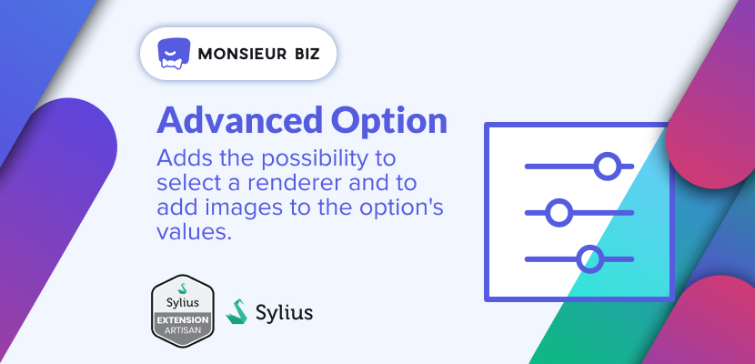

[](https://monsieurbiz.com/agence-web-experte-sylius)

<h1 align="center">Advanced Option</h1>

[](https://github.com/monsieurbiz/SyliusAdvancedOptionPlugin/blob/master/LICENSE.txt)
[](https://github.com/monsieurbiz/SyliusAdvancedOptionPlugin/actions?query=workflow%3ATests)
[](https://github.com/monsieurbiz/SyliusAdvancedOptionPlugin/actions?query=workflow%3ASecurity)
[](https://github.com/monsieurbiz/SyliusAdvancedOptionPlugin/actions?query=workflow%3ASecurity)

This plugins improves the Options in Sylius. It adds the possibility to select a renderer and to add images to the option's values.

## Compatibility

| Sylius Version | PHP Version     |
|----------------|-----------------|
| 1.12           | 8.1 - 8.2 - 8.3 |
| 1.13           | 8.1 - 8.2 - 8.3 |
| 1.14           | 8.1 - 8.2 - 8.3 |

## Installation

If you want to use our recipes, you can configure your composer.json by running:

```bash
composer config --no-plugins --json extra.symfony.endpoint '["https://api.github.com/repos/monsieurbiz/symfony-recipes/contents/index.json?ref=flex/master","flex://defaults"]'
```

```bash
composer require monsieurbiz/sylius-advanced-option-plugin
```

Change your `config/bundles.php` file to add this line for the plugin declaration:
```php
<?php

return [
    //..
    MonsieurBiz\SyliusAdvancedOptionPlugin\MonsieurBizSyliusAdvancedOptionPlugin::class => ['all' => true],
];
```

Then create the config file in `config/packages/monsieurbiz_sylius_advanced_option_plugin.yaml`:

```yaml
imports:
    - { resource: "@MonsieurBizSyliusAdvancedOptionPlugin/Resources/config/config.yaml" }
```

And create the route file in `config/routes/monsieurbiz_sylius_advanced_option_plugin.yaml`:

```yaml
monsieurbiz_advanced_option_admin:
    resource: "@MonsieurBizSyliusAdvancedOptionPlugin/Resources/config/routing/admin.yaml"
    prefix: /%sylius_admin.path_name%
```

Copy the templates we override:

```bash
cp -Rv vendor/monsieurbiz/sylius-advanced-option-plugin/src/Resources/templates/* templates/
```

Your ProductOption entity needs to implement the `RenderedOptionInterface` interface and use the `MonsieurBiz\SyliusAdvancedOptionPlugin\Entity\ProductOption\RenderedOptionTrait` trait. As in our test application: [ProductOption](dist/src/Entity/Product/ProductOption.php).

Your ProductOptionValue entity needs to implement the `RenderedOptionValueInterface` interface and use the `MonsieurBiz\SyliusAdvancedOptionPlugin\Entity\ProductOption\RenderedOptionValueTrait` trait.  As in our test application: [ProductOption](dist/src/Entity/Product/ProductOptionValue.php).

### Migrations

Migrations are taken care of by Doctrine 3.

You should just run them: 

```php
bin/console doctrine:migrations:migrate
```

### Template override

If you have already replaced the `templates/bundles/SyliusShopBundle/Product/Show/_options.html.twig` template in your theme, modify the content to use the twig functions:

- monsieurbiz_advancedoption_has_renderer
- monsieurbiz_advancedoption_form_row

Read the default override to get inspiration from its content: [_options.html.twig](/src/Resources/templates/bundles/SyliusShopBundle/Product/Show/_options.html.twig).

## Sponsors

- EasyMonneret

## Contributing

You can open an issue or a Pull Request if you want! 😘  
Thank you!
